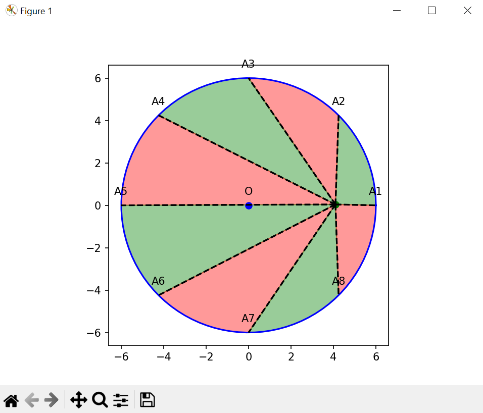

# watermelon-teorem
An interactive Python app developed to accompany the resolution of a math problem that is part of a wider pedagogical projet. The application uses Matplotlib to allow dynamic exploration of area constancy in a circle divided by rays from an interior movable point. 




**Dynamic Geometry Exploration with Matplotlib**

**Description**
This Python application is part of the CSEN | GT3 initiative aimed at creating a comprehensive database of mathematical problems. It serves as an interactive educational tool to explore a specific geometry problem involving area constancy in a circle divided by rays from an interior movable point. _To move point P, double-click the desired location._

**Instructions for Running the Application**
``` 
NEW Une version HTML du projet, intitulée `tracer_cercle4_JS.html`, est désormais disponible dans le sous-dossier `executable/HTML_version` pour une utilisation directement dans un navigateur web. _A HTML version of the project, titled `tracer_cercle4_JS.html`, is now available in the sub-folder `executable/HTML_version` for direct use in a web browser.
``` 

**For Windows Users**
If you are using Windows, you can simply download then execute the provided .exe file to run the application.

[Download the App](https://github.com/romainbourdoncle/watermelon-teorem/releases/download/v1.0.0/tracer_cercle4.exe)

**For macOS Users**
If you are using macOS, you need to run the code via the terminal. Please check the file named *tracer_cercle4* in the **src** folder for source code. Here are the steps to do so:
1. Open the terminal and navigate to the folder containing the script.
2. Install required packages:
```
pip install matplotlib pip numpy
```

4. Run the script:
```
python tracer_cercle4.py
```
**Contributing**
This project is part of the larger CSEN | GT3 initiative. Contributions are welcome, especially for educational purposes. For major changes, please open an issue first to discuss what you would like to change.

**License**
This project is licensed under CC BY-NC
